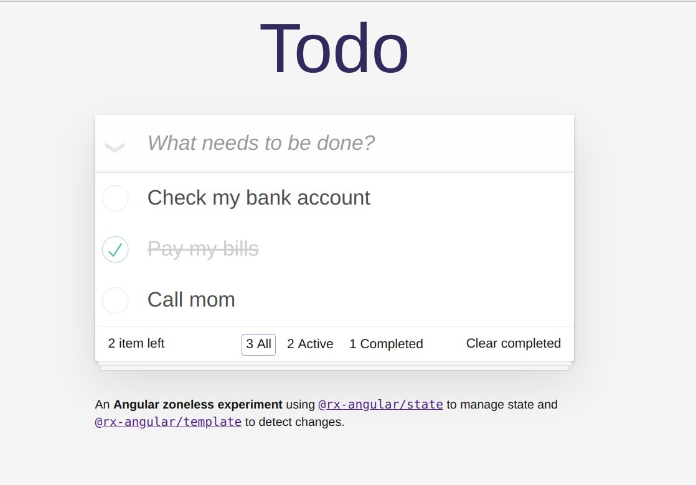

If you're interested in Reactive architectures you should hear about [RxAngular](https://github.com/rx-angular/rx-angular) which is a toolset for creating **fully reactive** as well as **fully zone-less** applications.

Let's dive into RxAngular by building a simple todo app from scratch.



If you don't know what's zone.js and what it does in Angular, I recommend you to [check this official guide](https://angular.io/guide/zone) before.

## Removing zone.js

Firstly let's get rid of the zone.js dependency :

```bash
$ yarn remove zone.js # or npm uninstall zone.js
```

Then tell Angular to run without ngZone : 

```ts
platformBrowserDynamic()
  .bootstrapModule(AppModule, {
    ngZone: 'noop'
  })
  .catch(err => console.error(err));
```

Finally remove the import statement in the `polyfills.ts` file :

```ts
import 'zone.js/dist/zone';  // 👈 Remove this.
```

Now our app is running fully zone-less and we will use RxAngular to manage our state and trigger change detection.

## Implementing the state

Here is what our todo app state will look.

```ts
export type TodoFilter = 'all' | 'completed' | 'active';

export interface Todo {
  id: number;
  text: string;
  done: boolean;
}

export interface TodoState {
  todos: Todo[];
  filter: TodoFilter;
}

export const INITIAL_STATE: TodoState = {
  filter: 'all',
  todos: [{ id: 0, text: 'Call mom', done: false }],
};
```

Let's create our service to hold the state and its related logic. 

Note that we won't provide the service in `root` but at component level because we're dealing with ephemeral state. This way the service gets destroyed along with the component.

```ts
@Injectable()
export class TodoService extends RxState<TodoState> {
  readonly allTodos$ = this.select('todos');
  readonly filter$ = this.select('filter');
}
```

Using the `RxState#select` function we can select and expose state slices to the component view. Under the hood some repetitive tasks are handled for us : 

- emit only distinct state changes
- filter out undefined state (lazy state)
- share subscription and replay last calculated value (performance)


## Deriving the state

The list of todo depends on the selected filter initialized with `'all'`. We can derive our base state using the RxJS `map` operator combined with some Array manipulations.

```ts
@Injectable()
export class TodoService extends RxState<TodoState> {
  /* ... */

  readonly todos$ = this.select().pipe(
      map(({ todos, filter }) =>
        todos.filter(({ done }) => {
          if (filter === 'all') return true;
          if (filter === 'active') return !done;
          if (filter === 'completed') return done;
        })
      )
  );

  readonly completedTodos$ = this.allTodos$.pipe(
    map((todos) => todos.filter((todo) => todo.done))
  );

  readonly activeTodos$ = this.allTodos$.pipe(
    map((todos) => todos.filter((todo) => !todo.done))
  );
}
```

Whenever the user change the filter, our `todos$` Observable emits filtered todos. You can think about derived state like [NgRx selectors](https://ngrx.io/guide/store/selectors).

## Adding actions

Now let's add what we can call user actions by creating a `Subject` for each one.

```ts
@Injectable()
export class TodoService extends RxState<TodoState> {
  private readonly _insert$ = new Subject<Partial<Todo>>();
  private readonly _remove$ = new Subject<Partial<Todo>>();
  private readonly _setText$ = new Subject<Partial<Todo>>();
  private readonly _toggle$ = new Subject<Partial<Todo>>();
  private readonly _toggleAll$ = new Subject<Partial<Todo>>();
  private readonly _clearCompleted$ = new Subject<Partial<Todo>>();
  private readonly _changeFilter$ = new Subject<TodoFilter>();

  /* ... */

  setFilter(filter: TodoFilter): void {
    this._changeFilter$.next(filter);
  }

  insert(todo: Partial<Todo>): void {
    this._insert$.next(todo);
  }

  remove(todo: Partial<Todo>): void {
    this._remove$.next(todo);
  }

  setText(todo: Partial<Todo>): void {
    this._setText$.next(todo);
  }

  toggle(todo: Partial<Todo>): void {
    this._toggle$.next(todo);
  }

  toggleAll(todo: Partial<Todo>): void {
    this._toggleAll$.next(todo);
  }

  clearCompleted(): void {
    this._clearCompleted$.next({ done: true });
  }
}
```

A `Subject` act as an event-bus to handle state updates. We will use these methods from the component side to trigger an action.

## Connecting transformations

To connect an action to its state a transformation we will use the `RxState#connect` function. It takes the slice as first argument and the source Observable to connect as second argument. 

```ts 
@Injectable()
export class TodoService extends RxState<TodoState> {
  /* ... */

  constructor() {
    super();
    this.set(INITIAL_STATE);
    this.connect('filter', this._changeFilter$);
    this.connect('todos', this._insert$, ({ todos }, { text }) =>
      insert(todos, { id: todos.length, text, done: false })
    );
    this.connect('todos', this._remove$, ({ todos }, { id }) =>
      remove(todos, { id }, 'id')
    );
    this.connect('todos', this._setText$, ({ todos }, { id, text }) =>
      update(todos, { id, text }, 'id')
    );
    this.connect('todos', this._toggle$, ({ todos }, { id, done }) =>
      update(todos, { id, done }, 'id')
    );
    this.connect('todos', this._toggleAll$, ({ todos }, { done }) =>
      update(todos, { done }, () => true)
    );
    this.connect('todos', this._clearCompleted$, ({ todos }, { done }) =>
      remove(todos, { done }, 'done')
    );
  }

  /* ... */
}
```

The last optional argument allows us to use a projection function which is a kind of state reducer. Here we're using RxAngular [transformation helpers](https://rx-angular.io/web/state/api/transformation-helpers) to manipulate our Array of todos.

Note that Subscriptions are automatically managed for us.

## Implementing the view

The important part here is the `providers` metadata and `TodoService` injection.

```ts
@Component({
  selector: 'app-todo-list',
  templateUrl: './todo-list.component.html',
  providers: [TodoService],
})
export class TodoListComponent {
  @ViewChild('input', { static: false }) input: ElementRef<HTMLInputElement>;
  @ViewChild('checkbox', { static: false }) checkbox: ElementRef<
    HTMLInputElement
  >;

  constructor(public readonly todoService: TodoService) {}

  insert(event: KeyboardEvent): void {
    if (event.keyCode === 13) {
      this.todoService.insert({ text: this.input.nativeElement.value });
      this.input.nativeElement.value = '';
    }
  }

  toggleAll(event: Event): void {
    this.todoService.toggleAll({ done: (event.target as any).checked });
  }
}
```

The template part will use the injected service to read and write the state.

```html
<header class="header">
  <h1>Todo</h1>
  <input
    #input
    class="new-todo"
    placeholder="What needs to be done?"
    (keyup)="insert($event)"
  />
</header>
<section class="main" *rxLet="todoService.todos$; let todos">
  <input
    id="toggle-all"
    #checkbox
    class="toggle-all"
    type="checkbox"
    (input)="toggleAll($event)"
  />
  <label for="toggle-all">Mark all as complete</label>
  <app-todo
    class="todo-list"
    *ngFor="let todo of todos"
    [todo]="todo"
    (updateText)="todoService.setText($event)"
    (toggle)="todoService.toggle($event)"
    (remove)="todoService.remove($event)"
  ></app-todo>
</section>
<footer class="footer">
  <span class="todo-count">
    <strong>{{ (todoService.active$ | push)?.length }}</strong> item left
  </span>
  <ul class="filters">
    <li>
      <button
        [class.selected]="(todoService.filter$ | push) === 'all'"
        (click)="todoService.setFilter('all')"
      >
        {{ (todoService.allTodos$ | push)?.length }} All
      </button>
    </li>
    <li>
      <button
        [class.selected]="(todoService.filter$ | push) === 'active'"
        (click)="todoService.setFilter('active')"
      >
        {{ (todoService.activeTodos$ | push)?.length }} Active
      </button>
    </li>
    <li>
      <button
        [class.selected]="(todoService.filter$ | push) === 'completed'"
        (click)="todoService.setFilter('completed')"
      >
        {{ (todoService.completedTodos$ | push)?.length }} Completed
      </button>
    </li>
  </ul>
  <button class="clear-completed" (click)="todoService.clearCompleted()">
    Clear completed
  </button>
</footer>
```

The `Push` pipe and the `*rxLet` directive bind the state to the view. These two building blocks basically listen state changes and perform rendering whenever it has changed.