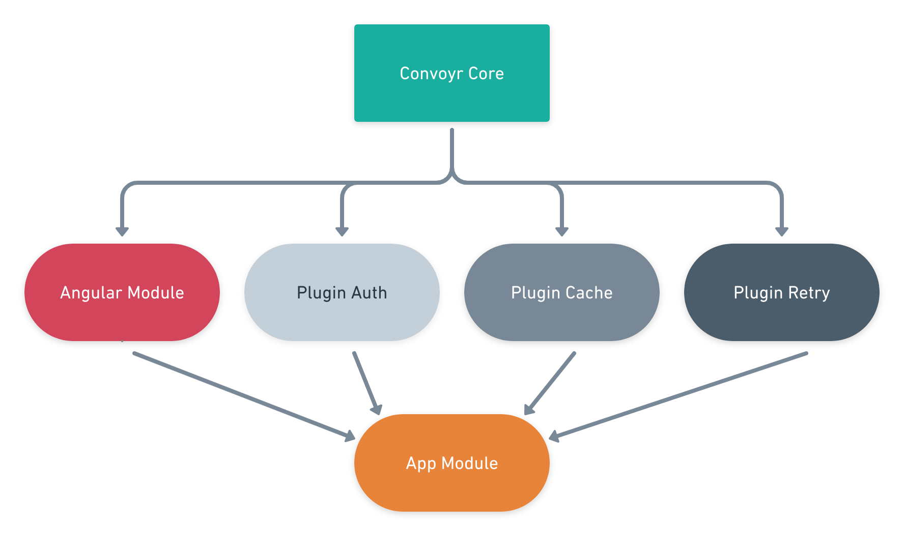
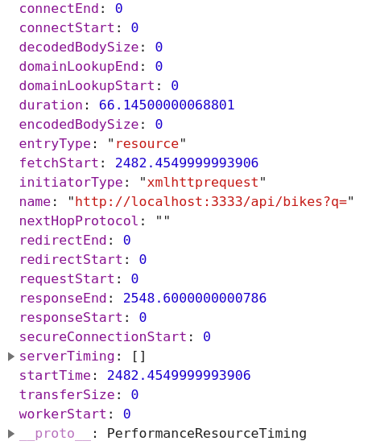

[Convoyr](https://github.com/jscutlery/convoyr) began with some discussions (and beers) with [@yjaaidi](https://twitter.com/yjaaidi) about the Angular community. At this time I was bored at my job and I wanted to push myself more in the open-source. Then we created the JScutlery organization for authoring open-source work and we started to code Convoyr.

> Convoyr has been built with one goal in mind: helping you to focus on your apps' features instead of the transport layer's boilerplate without any trade-off.

## Authentication with Interceptors

Let's start by a concrete example, if I want to authenticate HTTP requests in Angular I should use Interceptors. Here is an example grabbed from internet :

```ts
@Injectable()
export class TokenInterceptor implements HttpInterceptor {
  constructor(private auth: AuthService) {}

  intercept(
    request: HttpRequest<any>,
    next: HttpHandler
  ): Observable<HttpEvent<any>> {
    request = request.clone({
      setHeaders: {
        Authorization: `Bearer ${this.auth.getToken()}`,
      },
    });
    return next.handle(request);
  }
}
```

Then we should provide the `TokenInterceptor` in the `AppModule` :

```ts
@NgModule({
  providers: [
    {
      provide: HTTP_INTERCEPTORS,
      useClass: TokenInterceptor,
      multi: true,
    },
  ],
})
export class AppModule {}
```

I wrote this exact same thing many times, what's wrong with it ?

- Require verbose boilerplate just for setting a request header.
- May send API token to malicious remote origins.
- It's highly repetitive between apps.

## Authentication with Convoyr

Let's see the same authentication feature using Convoyr :

```ts
@NgModule({
  imports: [
    HttpExtModule.forRoot({
      deps: [AuthService],
      config: (auth: AuthService) => ({
        plugins: [
          createAuthPlugin({
            shouldHandleRequest: matchOrigin('https://my-secure-api.com'),
            token: auth.getToken(),
          }),
        ],
      }),
    }),
  ],
})
export class AppModule {}
```

There is no provider configuration required and security is improved with the `matchOrigin` function as the token will never be sent to any other origin except `https://my-secure-api.com`.

## How Convoyr was cooked

#### TDD and TCR

Convoyr has been built with TDD and TCR in dual programming. I recommend to checking out [extreme programming](https://guide-agile.wishtack.io/extreme-programming) which is a **software development methodology without the Agile commercial bullshit**. This lightweight methodology can help your team to resolve problems faster, better and stronger.

#### Monorepos style

Technically we use both Nx and Lerna to manage the monorepos. The codebase is splitted in different libraries :

- The Core which runs declared plugins and only depends on TypeScript and RxJS.
- The Angular module which makes the glue with the framework.
- The plugins collection which enhance HTTP capabilities.



Making the Core package agnostic from Angular give us a the possibility to be compatible with other HTTP clients, platforms and environments (e.g. server side).

#### Plugins

> The main building block is the plugin. A plugin is a simple object that lets you intercept network communications and control or transform them easily.

Convoyr comes with its built-in plugins collection to handle some complex and repetitive tasks for you. These plugins extends HTTP capabilities in three different axes : **security**, **performance** and **resilience**.

| Package                                                                                     | Description                                     |
| ------------------------------------------------------------------------------------------- | ----------------------------------------------- |
| [@convoyr/plugin-cache](https://github.com/jscutlery/convoyr/tree/master/libs/plugin-cache) | Respond with cache-then-network strategy.       |
| [@convoyr/plugin-retry](https://github.com/jscutlery/convoyr/tree/master/libs/plugin-retry) | Retry failed requests with exponential backoff. |
| [@convoyr/plugin-auth](https://github.com/jscutlery/convoyr/tree/master/libs/plugin-auth)   | Handle authentication.                          |

### Custom plugin examples

It's easy to implement its own custom plugin, here are some examples.

#### Response Logging

The handler is the object where the plugin logic is put.

```ts
import { ConvoyrPlugin } from '@http-ext/core';

export const loggerPlugin: ConvoyrPlugin = {
  handler: {
    handle({ request, next }) {
      return next
        .handle({ request })
        .pipe(
          tap((response) =>
            console.log(`${request.method} ${request.url}`, response.body)
          )
        );
    },
  },
};
```

The `next.handle({ request })` function lets you access the response stream and transform it before passing it to the next plugin.

#### Logging using Promises

Convoyr allows you to play with Observables, or Promises, or even synchronous calls.

```ts
import { ConvoyrPlugin } from '@http-ext/core';

export const loggerPlugin: ConvoyrPlugin = {
  handler: {
    async handle({ request, next }) {
      const response = await next.handle({ request }).toPromise();
      console.log(`${request.method} ${request.url}`, response.body);
      return response;
    },
  },
};
```

_However I recommend you to opt for the Observable approach since it provides a nicer API to manage asynchronous tasks._

#### Rejecting requests to unknown origins

The `shouldHandleRequest` function lets you conditionally handle requests :

```ts
import { ConvoyrPlugin, not, matchOrigin } from '@http-ext/core';

export const rejectUnknownOriginsPlugin: ConvoyrPlugin = {
  shouldHandleRequest: not(matchOrigin('https://github.com')),
  handler: {
    handle({ request, next }) {
      return throwError(`🛑 requesting invalid origin. url: ${request.url}`);
    },
  },
};
```

[Conditional handling](https://github.com/jscutlery/convoyr#conditional-handling) is a part of the core library. It's really useful to select which request the plugin should handle.

#### Camelize JSON Body keys

Recursively convert JSON body keys to camelcase using the `camelcase-keys` library.

```ts
import * as camelcaseKeys from 'camelcase-keys';
import {
  ConvoyrPlugin,
  and,
  matchMethod,
  matchResponseType,
} from '@http-ext/core';

export const camelCaseJsonKeysPlugin: ConvoyrPlugin = {
  shouldHandleRequest: and(matchMethod('GET'), matchResponseType('json')),
  handler: {
    handle({ request, next }) {
      return next.handle({ request }).pipe(
        map((response) => ({
          ...response,
          body: camelcaseKeys(response.body),
        }))
      );
    },
  },
};
```

#### Securing URLs

It should be nice to use HTTPS if the server doesn't redirect automatically.

```ts
import { ConvoyrPlugin } from '@http-ext/core';

export const secureUrlPlugin: ConvoyrPlugin = {
  shouldHandleRequest: ({ request }) => request.url.startsWith('http:'),
  handler: {
    handle({ request, next }) {
      return next.handle({
        request: {
          ...request,
          url: request.url.replace('http:', 'https:'),
        },
      });
    },
  },
};
```

#### Network Profiling

Here is a profiler example for measuring network performance.

```ts
import { ConvoyrPlugin } from '@http-ext/core';

function getPerformanceEntry(request: ConvoyrRequest): PerformanceEntry {
  const performanceEntryList = performance.getEntriesByName(
    request.url + queryString.stringify(request.params)
  );

  return performanceEntryList[performanceEntryList.length - 1];
}

export const performanceProfilerPlugin: ConvoyrPlugin = {
  handler: {
    handle({ request, next }) {
      return next.handle({ request }).pipe(
        finalize(() => {
          const performanceEntry = getPerformanceEntry(request);
          console.log(performanceEntry);
        })
      );
    },
  },
};
```

This will log something like this :



_Instead of rawly logging the result in the console we can imagine sending those performance measures to a remote server to create rich reports._

### Further with Convoyr

There is a [demo app workspace](https://github.com/jscutlery/convoyr/tree/master/apps/sandbox) in our monorepos which can be used as example to start with Convoyr.

We have many other things to do like adding installation schematics or creating other plugins. Any ideas or contributions are welcome.

Hope you will find it useful! 👋🏻
