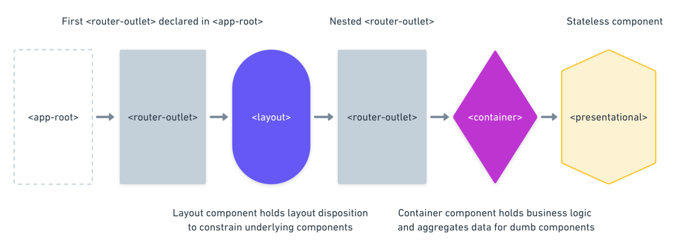

When building JavaScript applications we usually separate components in different layers, each one responsible of its own concern. You've certainly hear about presentational components, container components, or the less well known layout components?

> Let me try to explain to you, what is a layout component in Angular, and how to build modular applications using this technique.

Layout components are used to hold common layout composition. This design enables you to reuse layouts across different parts of your application. It will also simplify underlying components and enforce the single responsibility principle.

## The view layer architecture

The schema below illustrates the component three using a layout component. Layout components are realizable using the nested `<router-outlet>` technique.



Now let's see what does it looks like in code. Here is the root component that instantiates the first `<router-outlet>`.

```ts
import { Component } from '@angular/core';

@Component({
  selector: 'app-root',
  template: `
    <router-outlet></router-outlet>
  `,
})
export class AppComponent {}
```

Then we need to declare top level routes. Note that lazy loading is used to improve initial load performance.

```ts
import { Route } from '@angular/router';

export const APP_ROUTES: Route[] = [
  {
    path: '',
    redirectTo: '/dashboard',
    pathMatch: 'full'
  },
  {
    path: 'dashboard',
    loadChildren: () => import('./dashboard/dashboard.module').then(m => m.DashboardModule),
  }
];
```

At this point we have to bring this together in the `AppModule`.

```ts
import { NgModule } from '@angular/core';
import { BrowserModule } from '@angular/platform-browser';
import { RouterModule } from '@angular/router';

import { APP_ROUTES } from './routes';

@NgModule({
  imports: [BrowserModule, RouterModule.forRoot(APP_ROUTES)],
  bootstrap: [AppComponent],
})
export class AppModule {}
```

The next step is to create the layout component. Consider this simple scenario.

```ts
import { Component } from '@angular/core';

@Component({
  selector: 'app-main-layout',
  template: `
    <ng-container>
      <app-navbar></app-navbar>
      <router-outlet></router-outlet>
      <app-footer></app-footer>
    </ng-container>
  `,
})
export class MainLayoutComponent {}
```

The nested `<router-outlet>` is declared in `MainLayoutComponent`. The router will pass-through this layout component to resolve the child component, the final route, that matches the URL.

```ts
import { Route } from '@angular/router';

import { DashboardComponent } from './dashboard.component';
import { MainLayoutComponent } from './main-layout.component';

export const DASHBOARD_ROUTES: Route[] = [
  {
    path: '',
    component: MainLayoutComponent,
    children: [
      {
        path: '',
        component: DashboardComponent,
      },
    ],
  },
];
```

The piece of code above stick all together, layout and container are combined in a declarative way using the routes three.

Imagine we want to swap the `MainLayoutComponent` with a new `SidebarLayoutComponent`. We can easily achieve this without changing the `DashboardComponent` template.
