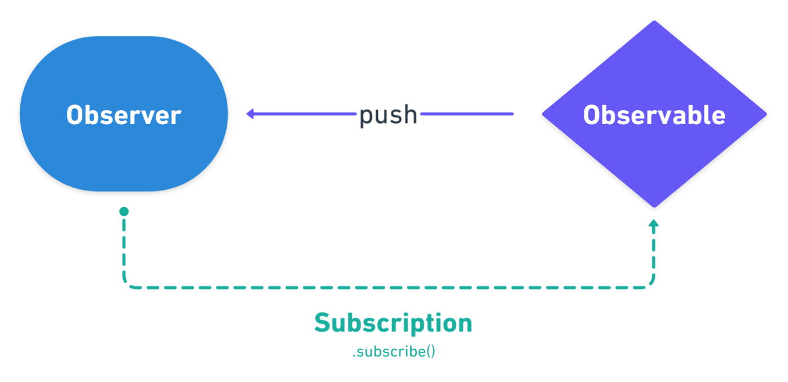
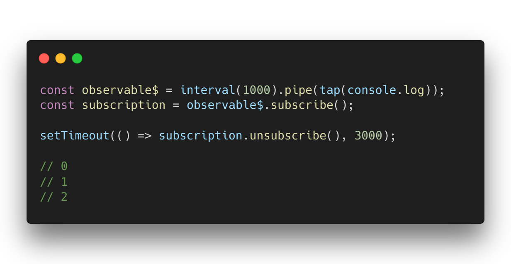

> This blog post was originally a talk I gave at [Angular Lyon meetup](https://www.meetup.com/fr-FR/Angular-Lyon/). Subscribe for further cool events.

You probably know that Observables are everywhere in Angular, a lot of stuff operates using them. In fact **they are used to know when and what to do**.

Before tackling the management subject let's have a look to the Subscription anatomy.

To create a Subscription we need to call the `.subscribe()` method on the Observable. **It's an object that holds the Observable execution**, it represents the connection between an Observable and an Observer.



By default Observables are lazy (or cold), which means **they don't produce any value before the system subscribes to them**. Once the Subscription is made, the Observable emits between zero or an infinity of values over time.

As we usually do with standard functions like `removeEventListener()` or `clearInterval()` we also need to cleanup the Observable execution to avoid memory leaks.



The Subscription has one important method `.unsubscribe()` that stop the Observable execution and dispose the resource held by the Subscription. Cancellation is a powerful mechanism that prevent doing useless computations.

We usually think that memory leaks are hidden, or imperceptible. It's completely wrong, it might degrade the user's experience by causing weird behaviors, or crashing the whole application.


When dealing with Angular and RxJS managing subscriptions is mission-critical.

#### 👎🏼 Common pitfall

To illustrate the subject I use a `BookService` which expose a long-lived Observable `availableBooks$`.

In this first example the Subscription is not cleared, resulting in a memory leak.

```ts
@Component({
  selector: 'book-list',
  template: `
    <ul *ngIf="books.length">
      <li *ngFor="let book of books">
        {{ book.title }}
      </li>
    </ul>
  `,
})
export class BookListComponent implements OnInit {
  books: Book[] = [];

  constructor(private bookService: BookService) {}

  ngOnInit(): void {
    // highlight-start
    this.bookService.availableBooks$.subscribe(list => { // <- memory leak
      // highlight-end
      this.books = list;
    });
  }
}
```

When the `BookListComponent` get destroyed the `availableBooks$` Observable keeps running in a background as a zombie. The runtime cannot cleanup the memory, the component and all its related objects will stay in memory.

#### 👍🏼 Referenced Subscription

To fix this issue, the most common approach is to use a referenced Subscription to be able to call the `.unsubscribe()` method when the component get destroyed.

```ts
@Component({
  selector: 'book-list',
  template: `
    <ul *ngIf="books.length">
      <li *ngFor="let book of books">
        {{ book.title }}
      </li>
    </ul>
  `,
})
export class BookListComponent implements OnInit, OnDestroy {
  private _subscription: Subscription; // highlight-line

  books: Book[] = [];

  constructor(private bookService: BookService) {}

  ngOnInit(): void {
    // highlight-start
    this._subscription = this.bookService.availableBooks$.subscribe(books => {
      // highlight-end
      this.books = books;
    });
  }

  // highlight-start
  ngOnDestroy(): void {
    this._subscription.unsubscribe();
  }
  // highlight-end
}
```

This way our component requires extra logic to clear the Observable execution, verbosity is kind of pollution in the component. Moreover this approach is imperative, it's preferable to use something more declarative to hide the noise.

#### 👍🏼👍🏼 private subject + takeUntil

An other approach is to use a `Subject` to notify whenever the component get destroyed in combination with the `takeUntil` operator to cleanup the Observable execution.

```ts
@Component({
  selector: 'book-list',
  template: `
    <ul *ngIf="books.length">
      <li *ngFor="let book of books">
        {{ book.title }}
      </li>
    </ul>
  `,
})
export class BookListComponent implements OnInit, OnDestroy {
  private _destroy$ = new Subject<void>(); // highlight-line

  books: Book[] = [];

  constructor(private bookService: BookService) {}

  ngOnInit(): void {
    this.bookService.availableBooks$
      .pipe(
        tap(books => {
          this.books = books;
        }),
        takeUntil(this._destroy$) // highlight-line
      )
      .subscribe();
  }

  // highlight-start
  ngOnDestroy(): void {
    this._destroy$.next();
  }
  // highlight-end
}
```

Note that we don't need to call `.complete()` method because a Subject without subscriber is just a function.

This implementation still needs some extra code in the component. The good point is that we can handle many subscriptions using one single operator.

#### 👍🏼👍🏼👍🏼 Async pipe

Angular natively comes with the powerful `async` pipe to effortlessly manage view subscriptions.

- No extraneous code in the component.
- Automated Subscription management.
- Automated change detection via `OnPush` change detection strategy.

```ts
@Component({
  selector: 'book-list',
  template: `
    // highlight-start
    <ul *ngIf="books$ | async as books">
      <li *ngFor="let book of books">
        // highlight-end
        {{ book.title }}
      </li>
    </ul>
  `,
})
export class BookListComponent {
  // highlight-start
  books$: Observable<Book[]> = this.bookService.availableBooks$;
  // highlight-end

  constructor(private bookService: BookService) {}
}
```

This approach removes a lot of code and looks significantly better.

But sometimes we need more than one Subscription in the view context, in this case instead of doing this imbrication.

```html
<ng-container *ngIf="book$ | async as book">
  <div *ngIf="category$ | async as category">
    {{ book.title }} {{ category.name }}
  </div>
</ng-container>
```

Consider the following for readability.

```html
<div *ngIf="{ book: book$ | async, category: category$ | async } as vm">
  {{ vm.book.title }} {{ vm.category.name }}
</div>
```

An other problem is when the Observable implies an heavy computation needed at some different places. For example the Observable makes an XHR request to get some data.

```html
<div *ngIf="(books$ | async)?.length as length">
  Total: {{ length }}
</div>
<ul *ngIf="books$ | async as books">
  <li *ngFor="let book of books">
    {{ book.title }}
  </li>
</ul>
```

Using the pipe async at two different places will re-execute the XHR request twice. In this case the solution is to share the Subscription.

```ts
@Component({ /* ... */ })
export class BookListComponent {
  books$: Observable<Book[]> = this.http
    .get('http://api.book.com')
    .pipe(shareReplay({ refCount: true, bufferSize: 1 })); // highlight-line

  constructor(private http: HttpClient) {}
}
```

This is called multicasting, now the HTTP result is cached and shared amongst multiple subscribers.

#### 👍🏼👍🏼👍🏼 Third party garbage collector

An other approach is to use a dedicated library that handle Subscriptions for us. There are a bunch of libraries offering these kind of utils.

- [Mindspace-io rxjs-utils](https://github.com/ThomasBurleson/mindspace-utils/blob/master/lib/utils/src/lib/rxjs/README.md)
- [Wishtack Rx-Scavenger](https://github.com/wishtack/wishtack-steroids/tree/master/packages/rx-scavenger)
- [Ngneat until-destroy](https://github.com/ngneat/until-destroy)

In this example I used the `@ngneat/until-destroy` library.

```ts
@UntilDestroy() // highlight-line
@Component({
  selector: 'book-list',
  template: `
    <ul *ngIf="books.length">
      <li *ngFor="let book of books">
        {{ book.title }}
      </li>
    </ul>
  `,
})
export class BookListComponent implements OnInit {
  books: Book[] = [];

  constructor(private bookService: BookService) {}

  ngOnInit(): void {
    this.books
      .pipe(untilDestroyed(this)) // highlight-line
      .subscribe(books => (this.books = books));
  }
}
```

Using this approach we don't care about subscriptions anymore, the library manage this for us.

### To sum up

We have seen 4 different techniques to manage subscriptions.

The best solution depends on the context, but I recommend to **use the async pipe in prior**. If your application grows in complexity, then consider using a library.

`oembed: https://twitter.com/Michael_Hladky/status/1180316203937681410`

The simplest way to manage subscriptions is to let something else handle it for you. This mean that in most cases you don't have to call `.unsubscribe()` yourself.
